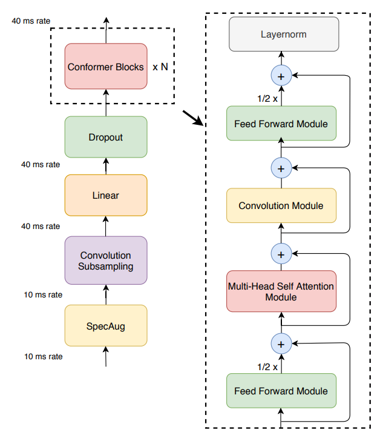

# Conformer: Convolution-augmented Transformer for Speech Recognition
[Unofficial] Implementation of the publication "Conformer: Convolution-augmented Transformer for Speech Recognition" by Anmol Gulati et.al
 
Published 16 May 2020.

The Conformer architecture represents a large advancement in the field of Automatic Speech Recognition (ASR). Developed by researchers at Google, Conformer integrates convolutional neural networks (CNNs) with Transformer models to effectively capture both local and global dependencies in audio sequences. This innovative approach combined the strengths of CNNs in exploiting local features and Transformers in modeling long-range global interactions, achieving state-of-the-art results on the LibriSpeech benchmark.

Extensive authors' experimentation and ablation studies highlighted the importance of each component within the Conformer model. Key findings included the superior performance of the convolution module when placed after the self-attention module and the effectiveness of using macaron-style feed-forward layers.
   

# Architecture

 
 
The architecture introduced a novel combination of self-attention and convolution modules, sandwiched between macaron-like feed-forward layers, which ensures parameter efficiency and improved performance. This model's versatility was demonstrated with three versions (small, medium, and large), showing competitive performance even with a parameter size as small as 10M.
   

# Results

At the time of the publication Conformer surpassed all other Automatic Speech Recognition models on a standard LibriSpeech dataset.
It significantly outperformed previous models by achieving a Word Error Rate (WER) of 2.1%/4.3% without using a language model, and 1.9%/3.9% with an external language model on the test/test-other datasets.

<small>

| Method            | #Params (M) | WER Without LM (testclean) | WER Without LM (testother) | WER With LM (testclean) | WER With LM (testother) |
|-------------------|-------------|-----------------------------|----------------------------|--------------------------|-------------------------|
| **Hybrid**        |             |                             |                            |                          |                         |
| Transformer [33]  | -           |                             |                            | 2.26                     | 4.85                    |
| **CTC**           |             |                             |                            |                          |                         |
| QuartzNet [9]     | 19          | 3.90                        | 11.28                      | 2.69                     | 7.25                    |
| **LAS**           |             |                             |                            |                          |                         |
| Transformer [34]  | 270         | 2.89                        | 6.98                       | 2.33                     | 5.17                    |
| Transformer [19]  | -           | 2.2                         | 5.6                        | 2.6                      | 5.7                     |
| LSTM              | 360         | 2.6                         | 6.0                        | 2.2                      | 5.2                     |
| **Transducer**    |             |                             |                            |                          |                         |
| Transformer [7]   | 139         | 2.4                         | 5.6                        | 2.0                      | 4.6                     |
| ContextNet(S) [10]| 10.8        | 2.9                         | 7.0                        | 2.3                      | 5.5                     |
| ContextNet(M) [10]| 31.4        | 2.4                         | 5.4                        | 2.0                      | 4.5                     |
| ContextNet(L) [10]| 112.7       | 2.1                         | 4.6                        | 1.9                      | 4.1                     |
| **Conformer (Ours)**|           |                             |                            |                          |                         |
| Conformer(S)      | 10.3        | **2.7**                     | 6.3                        | 2.1                      | 5.0                     |
| Conformer(M)      | 30.7        | **2.3**                     | **5.0**                    | **2.0**                  | 4.3                     |
| Conformer(L)      | 118.8       | **2.1**                     | **4.3**                    | **1.9**                  | **3.9**                 |

</small>

